<div align="center">
  
</div>

<div align="center">
  
</div>

<br>

<div align="center">

[](https://www.linkedin.com/in/pranav-mishra-9a75a8320/)
[](https://leetcode.com/u/codeXpranav/)
[](https://www.hackerrank.com/pvmishra2004)
[](mailto:pvmishra2004@gmail.com)

</div>

##  About Me

```javascript
const pranav = {
    name: "Pranav Mishra",
    role: "Software Engineer • Full-Stack Developer • AI/ML Enthusiast",
    education: "B.Tech CSE (AI/ML) @ SRMIST",
    cgpa: "9.32/10 🎓",
    location: "India 🇮🇳",

    expertise: {
        languages: ["C++", "Java", "Python", "JavaScript", "TypeScript"],
        frontend: ["React", "Next.js", "Tailwind CSS", "GSAP"],
        backend: ["Node.js", "Express", "REST APIs", "GraphQL"],
        database: ["MongoDB", "MySQL", "PostgreSQL", "Firebase"],
        aiml: ["TensorFlow", "Scikit-learn", "Gemini API", "OpenCV", "LLMs"],
        cloud: ["AWS", "Docker", "Google Cloud", "Vercel"]
    },

    achievements: [
        "🏆 Adobe India Hackathon Semi-Finalist",
        "🥇 Engineers Day Hackathon Winner",
        "⚡ 300+ DSA Problems Solved",
        "🏅 Smart India Hackathon Qualifier"
    ],

    currentlyExploring: [
        "System Design",
        "Distributed Systems",
        "Machine Learning",
        "Scalable Backend Engineering"
    ],

    motto: "Building intelligent software that solves real-world problems 🚀"
};
```
## 💼 Experience

### 🚀 Software Engineering Intern | WPSPOOLS

```diff
+ Reduced API latency by 30%
+ Improved release cycle efficiency by 40%
+ Worked on scalable backend architectures
```

### 🤖 ML, Data Science & AI Intern | Coding Blocks

```diff
+ Built end-to-end Machine Learning pipelines
+ Worked with NumPy, Pandas and Scikit-Learn
+ Developed scalable data processing workflows
```

## 🛠️ Tech Stack

<table align="center">
<tr>
<td align="center" width="96">

<br>Python
</td>
<td align="center" width="96">

<br>JavaScript
</td>
<td align="center" width="96">

<br>TypeScript
</td>
<td align="center" width="96">

<br>React
</td>
<td align="center" width="96">

<br>Next.js
</td>
<td align="center" width="96">

<br>Node.js
</td>
<td align="center" width="96">

<br>Express
</td>
<td align="center" width="96">

<br>MySQL
</td>
</tr>
<tr>
<td align="center" width="96">

<br>MongoDB
</td>
<td align="center" width="96">

<br>Firebase
</td>
<td align="center" width="96">

<br>TensorFlow
</td>
<td align="center" width="96">

<br>AWS
</td>
<td align="center" width="96">

<br>Tailwind
</td>
<td align="center" width="96">

<br>Docker
</td>
<td align="center" width="96">

<br>GitHub
</td>
<td align="center" width="96">

<br>Figma
</td>
</tr>
</table>

## 📊 GitHub Stats

<div align="center">
  
  
</div>

<div align="center">
  
</div>

## 📈 Contribution Graph

<div align="center">
  
</div>


## 🐍 Contribution Snake

<picture>
  <source media="(prefers-color-scheme: dark)" srcset="https://github.com/prnvmishra/prnvmishra/blob/output/github-contribution-grid-snake-dark.svg">
  <source media="(prefers-color-scheme: light)" srcset="https://github.com/prnvmishra/prnvmishra/blob/output/github-contribution-grid-snake.svg">
  
</picture>

## 🚀 GitHub Metrics

<div align="center">
  
</div>
  
  ### 💫 Let's connect and create something extraordinary!
  
  <br>
  
  
</div>

## 💡 Today's Coding Wisdom

<!--QUOTE_START-->
> 💡 The art of programming is the art of organizing complexity. – Edsger W. Dijkstra
<!--QUOTE_END-->
